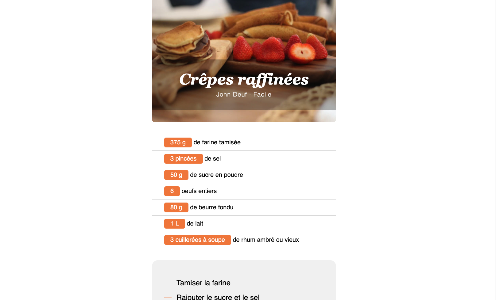

# :cake: A Recipe sheet 

## Create a recipe page from a React project.
## Create the different components necessary to reproduce this recipe sheet

## Illustration

## Language
- html5
- css3/Scss
- React/Javascript/JSX

## Goals 
- Fundamentals (Javascript)
- Stateless Component
- React architecture
- Starter

## Status
Project completed

## Context
Project carried out during my training as a web developer
